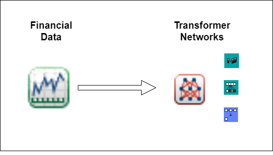
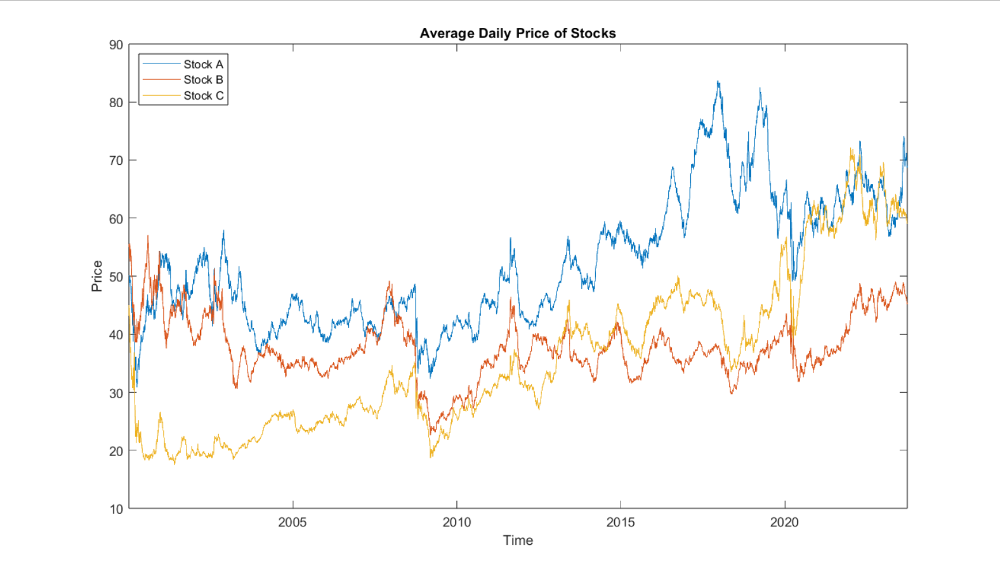
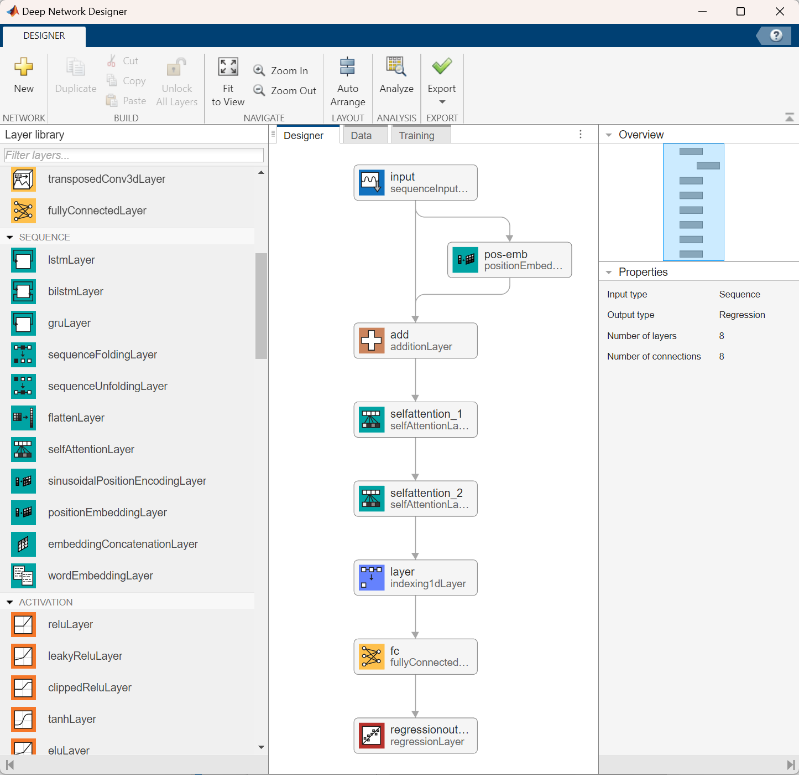
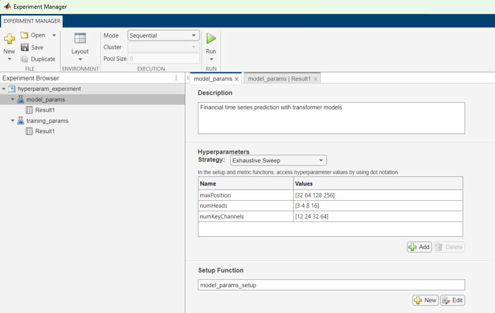
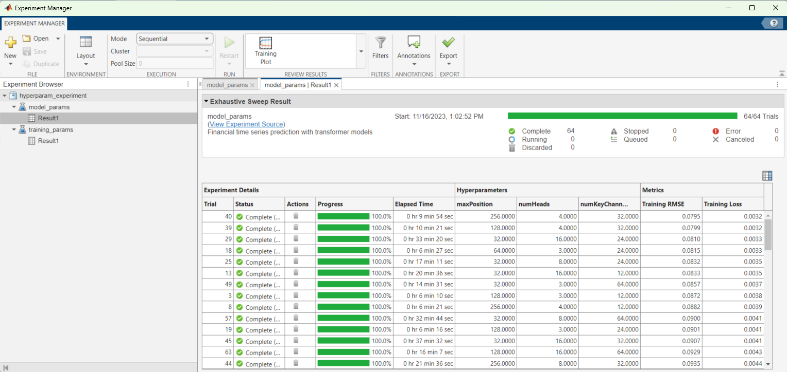
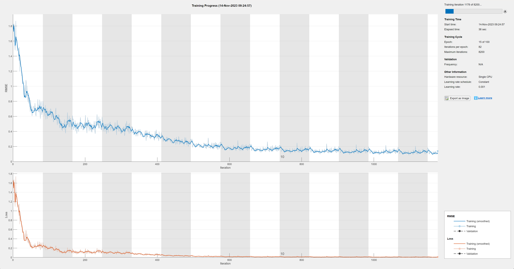
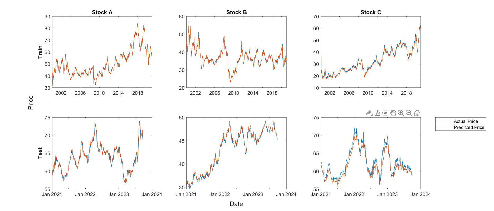
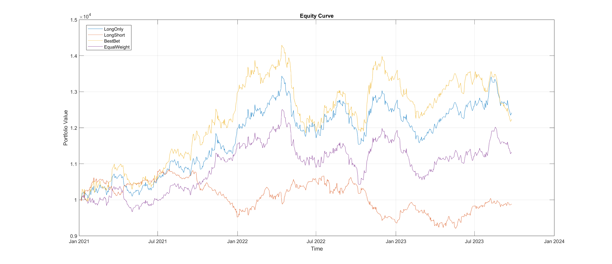
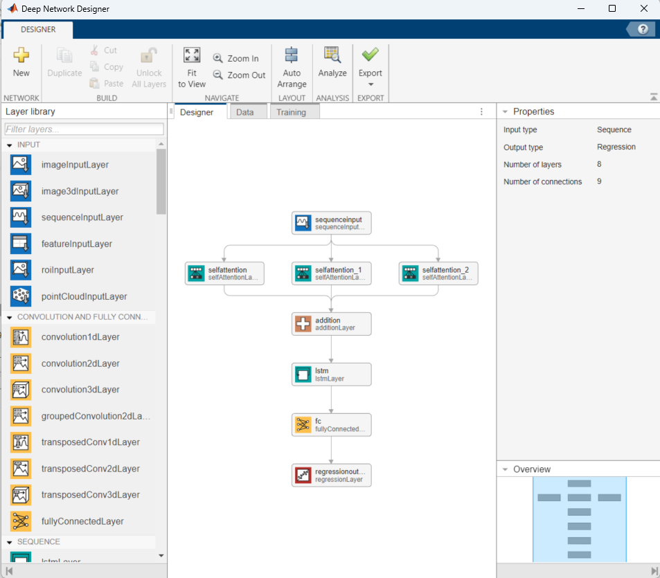

# Deep Learning in Quantitative Finance: Transformer Networks for Time Series Prediction



This demo shows how to use transformer networks to model the daily prices of stocks in MATLAB&reg;. We will predict the price trends of three individual stocks and use the predicted time series values to backtest trading strategies.

## Setup
To run:
- transformer_demo.mlx

Required files:
- transformer_demo.mat

This file contains the data need to follow the demo, as well as a pretrained model for easier use of the demo.

### MathWorks Products (https://www.mathworks.com)

Requires MATLAB release R2023b or newer
- [Deep Learning Toolbox&trade;](https://www.mathworks.com/products/deep-learning.html)
- [Financial Toolbox&trade;](https://www.mathworks.com/products/finance.html)
- [Optimization Toolbox&trade;](https://www.mathworks.com/products/optimization.html)
- [Statistics and Machine Learning Toolbox&trade;](https://www.mathworks.com/products/statistics.html)

Optional
- [Parallel Computing Toolbox&trade;](https://www.mathworks.com/products/parallel-computing.html)

## Getting Started

New layers have been introduced in MATLAB R2023a and R2023b that allow for the introduction of transformer layers to network architectures developed using the Deep Network Designer. These new transformer layers are useful for performing time series prediction with financial data due to their ability to capture temporal dependencies and long-term dependencies in the data. The three layers that the following demo utilizes are the [positionEmbeddingLayer](https://www.mathworks.com/help/deeplearning/ref/nnet.cnn.layer.positionembeddinglayer.html), [selfAttentionLayer](https://www.mathworks.com/help/deeplearning/ref/nnet.cnn.layer.selfattentionlayer.html), and [indexing1dlayer](https://www.mathworks.com/help/deeplearning/ref/nnet.cnn.layer.indexing1dlayer.html).

- The `positionEmbeddingLayer` allows for the encoding of the position information of each element within the sequence. By incorporating position embedding, the model can learn to differentiate between different time steps and capture time dependencies within the data.
- The `selfAttentionLayer` allows the model to weigh the importance of different elements within a sequence. This enables the model to capture the dependencies between all elements in the sequence and learn the relationships between them. Self-attention mechanisms are also effective at capturing long-term dependencies in the data, as they can establish connections between distant time steps, understanding patterns that may have a delayed impact on future outcomes.
- The `indexing1dLayer` allows for the extraction of data from the specified index of the input data. This enables the network to perform regression on the output of the `selfAttentionLayer`.

## Import and Preprocess Data



We begin by preprocessing the data, partitioning the dataset into training and testing sets based on the date. For this dataset, the cutoff date for the split between training and testing data is the beginning of 2021. After partitioning the dataset, we standardize the training data and normalize the testing data based on the mean and standard deviation of the training data. 

With our normalized data, we define a 30-day array of prices corresponding to each price in the dataset to serve as the sequential input for our model. Each 30-day rolling window of actual price data will be used to predict the price on the next day.

## Define Network Architecture and Training Options

Now that we have preprocessed the data, we can specify our network architecture and training options for our deep learning model. We can specify our network architecture as a series of layers, either using the Deep Network Designer or programmatically in MATLAB. Below is both a programmatic implementation of our architecture as well as a visualization of our chosen network architecture in the Deep Network Designer.

```
numChannels = 3;
maxPosition = 256;
numHeads = 4;
numKeyChannels = numHeads*32;

layers = [ 
    sequenceInputLayer(numChannels,Name="input")
    positionEmbeddingLayer(numChannels,maxPosition,Name="pos-emb");
    additionLayer(2, Name="add")
    selfAttentionLayer(numHeads,numKeyChannels,'AttentionMask','causal')
    selfAttentionLayer(numHeads,numKeyChannels)
    indexing1dLayer("last")
    fullyConnectedLayer(numChannels)
    regressionLayer];

lgraph = layerGraph(layers);
lgraph = connectLayers(lgraph,"input","add/in2");
```



After specifying our network architecture, we also need to specify the training options for our model using the `trainingOptions` function. Below are the training options chosen for this network architecture. Within these training options, we can specify the execution to use a GPU without needing to change any of our model architecture. In order to train using a GPU or a parallel pool, the Parallel Computing Toolbox&trade; is required.

```
maxEpochs = 100;
miniBatchSize = 32;
learningRate = 0.001;
solver = 'adam';
shuffle = 'every-epoch';
gradientThreshold = 10;
executionEnvironment = "auto"; % chooses local GPU if available, otherwise CPU

options = trainingOptions(solver, ...
    'Plots','training-progress', ...
    'MaxEpochs', maxEpochs, ...
    'MiniBatchSize', miniBatchSize, ...
    'Shuffle', shuffle, ...
    'InitialLearnRate', learningRate, ...
    'GradientThreshold', gradientThreshold, ...
    'ExecutionEnvironment', executionEnvironment);
```

## Tuning Hyperparameters

An excellent way to test different hyperparameters for both our network architecture and training options is through the Experiment Manager, which is part of the Deep Learning Toolbox&trade;. A tutorial on using the Experiment Manager for training deep learning networks can be found [here](https://www.mathworks.com/videos/interactively-build-experiments-to-fine-tune-and-compare-deep-learning-networks-1601541140381.html). Below is the setup and output of an experiment designed to tune the hyperparameters of the network architecture in this demo. This experiment can be found in the subfolder `hyperparameter_experiment`.




## Train the Model and Visualize Performance

Now that we have defined our network architecture and training options, we can utilize the `trainNetwork` function to train our model. Below is an image of the training progress partway through the model's training.



With a trained model, we can make predictions on the price of each stock based on the previous 30-day rolling window and compare them to the actual historical stock prices. Below is a plot comparing the model's predictions to the actual stock prices, split into train and test sets.



In addition to visualizing the performance of our model, we can calculate the root mean squared error (RMSE) to get a quantitative estimate of the quality of our predictions. RMSE measures the average difference between the predicted and actual stock prices, providing an indication of the model’s accuracy. The percentage RMSE over the training data based on the average price of each stock over the training period is 1.05%, 1.17%, and 2.30% for stocks A, B, and C respectively. The percentage RMSE over the testing data based on the average price of each stock over the testing period is 0.87%, 0.97%, and 1.98% for stocks A, B, and C respectively.

## Backtest Model Predictions on Market Data

While RMSE is a common way to quantify the performance of a set of predictions, our objective with these predictions is to use them to develop a strategy that will be profitable over the testing data. To test the profitability of the trading strategies, we can use the backtesting tools from the Financial Toolbox&trade;. The four trading strategies implemented in this demo are:

- Long Only: Invest all capital across the stocks with a positive predicted return, proportional to the predicted return.
- Long Short: Invest capital across all the stocks, both positive and negative predicted return, proportional to the predicted return.
- Best Bet: Invest all capital into the single asset with the highest predicted return.
- Equal Weight: Rebalance invested capital every day with an equally-weighted allocation between the stocks (benchmark).

Below is an equity curve that shows the performance of each of these trading strategies over the duration of the testing data.



Based on the equity curve above, we can see that our model predictions result in a 24% return when implemented with the Long Only strategy, and a 22% return when implemented with the Best Bet strategy, if we had invested based on them starting in January 2021. The Equal Weight strategy does not consider our model predictions and serves as a baseline performance metric for the underlying equities, with a 13% return over the testing period. These results give an indication that predictions from our model could help develop a profitable trading strategy.

While these backtest results provide insights into the profitability and effectiveness of the trading strategies implemented using the model predictions, the model and the trading strategies used to test its predictive results are not expected to be profitable in a realistic trading scenario. This demo is meant to illustrate a workflow that should be useful with more comprehensive datasets and more sophisticated models and strategies.

## Appendix

The network architecture used in this demo is just one possible implementation of the new transformer layers. Below is a visualization of another network that was considered for this demo. The MATLAB code for this network and several other candidate networks can be found in the file `candidate_networks.mlx`.



### References

The implementation of this demo was inspired by the paper "Time Series Forecasting with Transformer Models and Application to Asset Management" by Lezmi and Xu. This paper investigates applying trandofrmer models to time series forecasting specifically in the domain of finance. Access to the paper can be found [here](https://papers.ssrn.com/sol3/papers.cfm?abstract_id=4375798).

The MATLAB implementation of the transformer layers as well as the explanations provided in this demo come from the paper "Attention Is All You Need" by Vaswani et. al. This paper proposes the Transformer network architecture based on attention mechanism. Access to the paper can be found [here](https://arxiv.org/abs/1706.03762).

## License
The license is available in the License.txt file in this GitHub repository.

## Community Support
[MATLAB Central](https://www.mathworks.com/matlabcentral)

Copyright 2024 The MathWorks, Inc.

